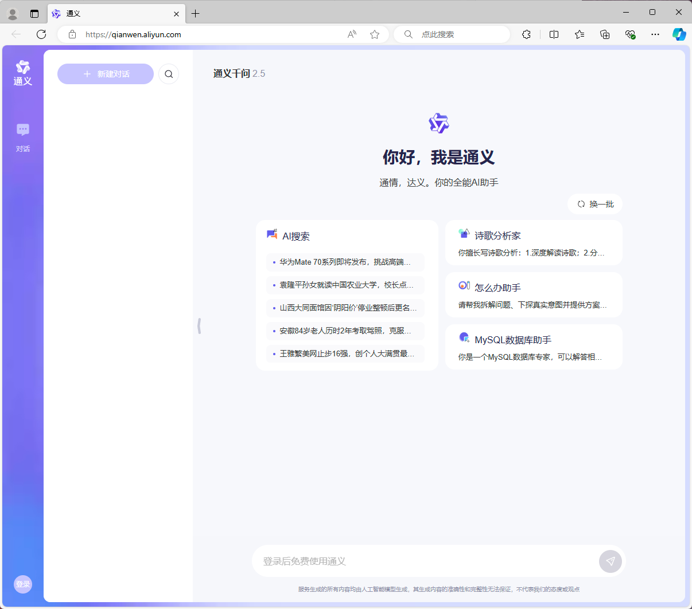
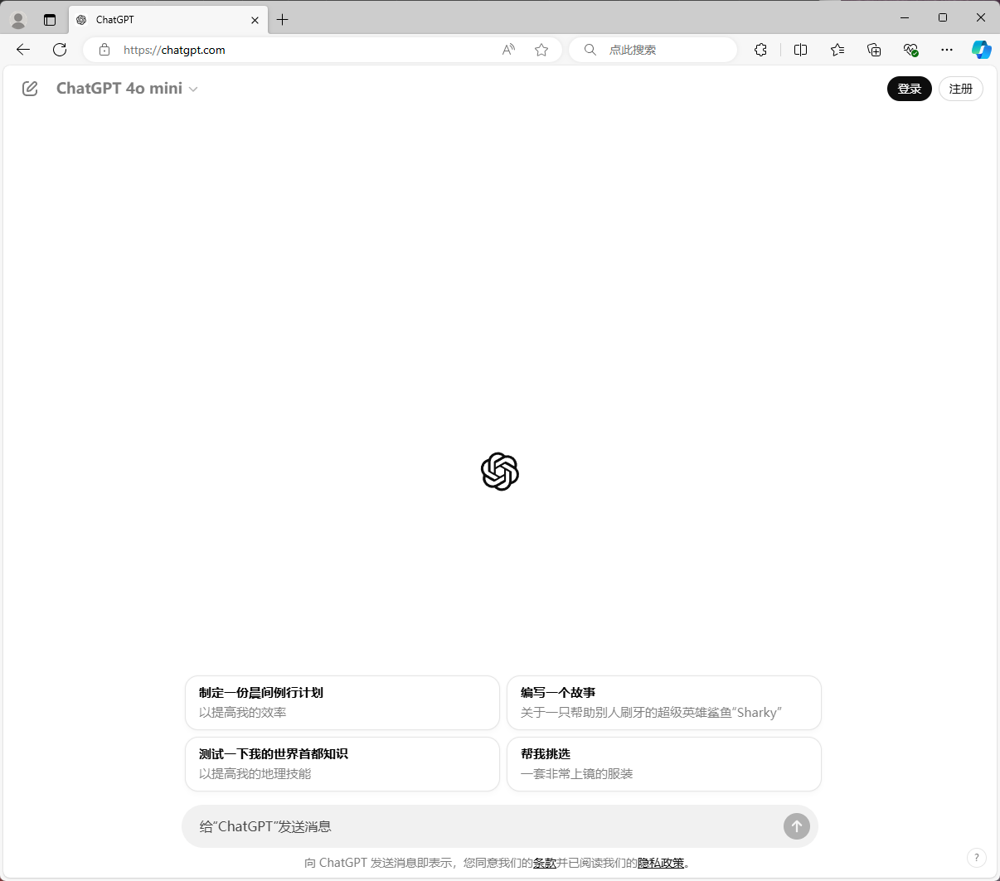
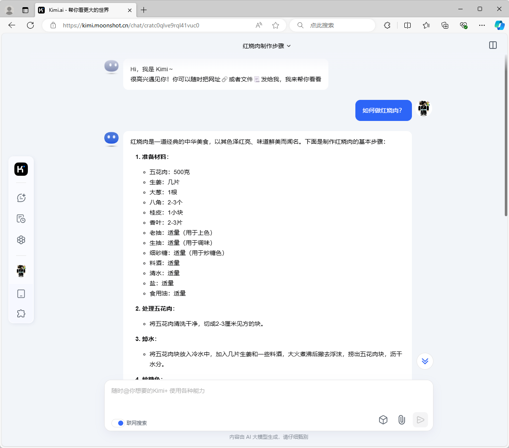
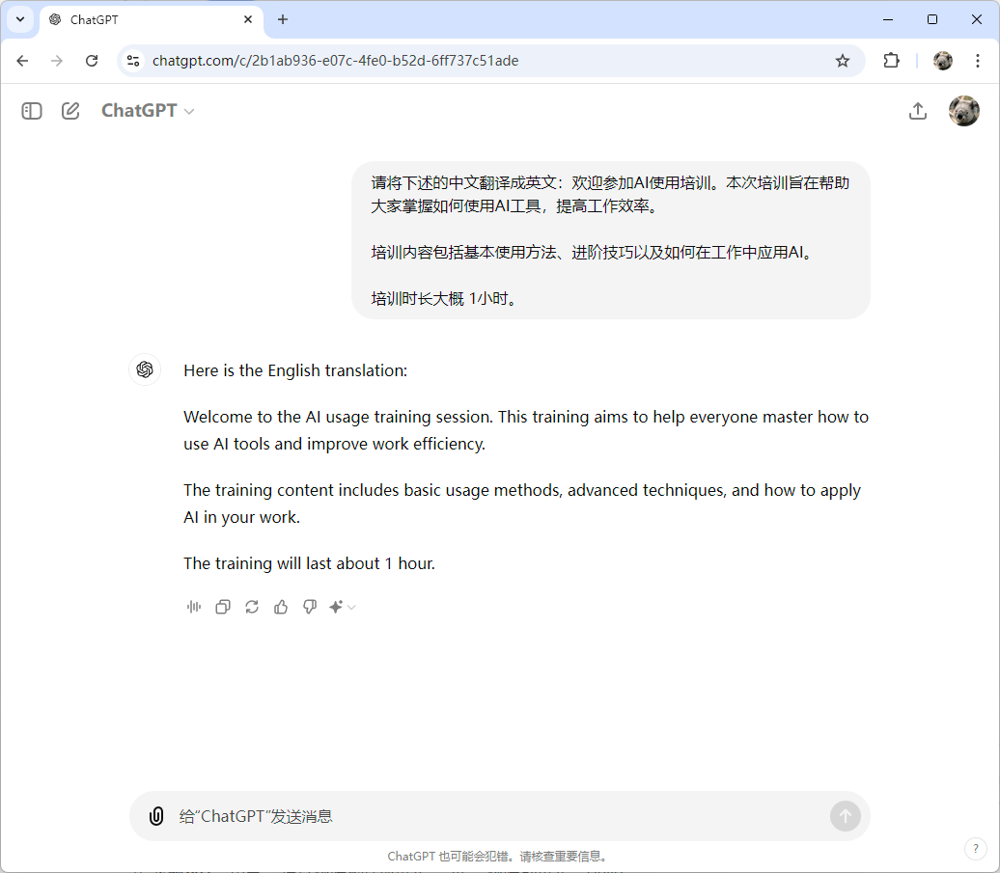
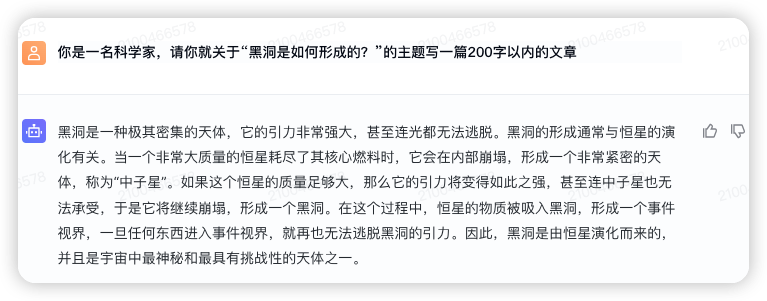
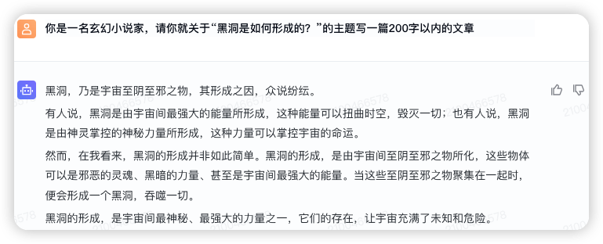
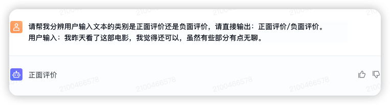
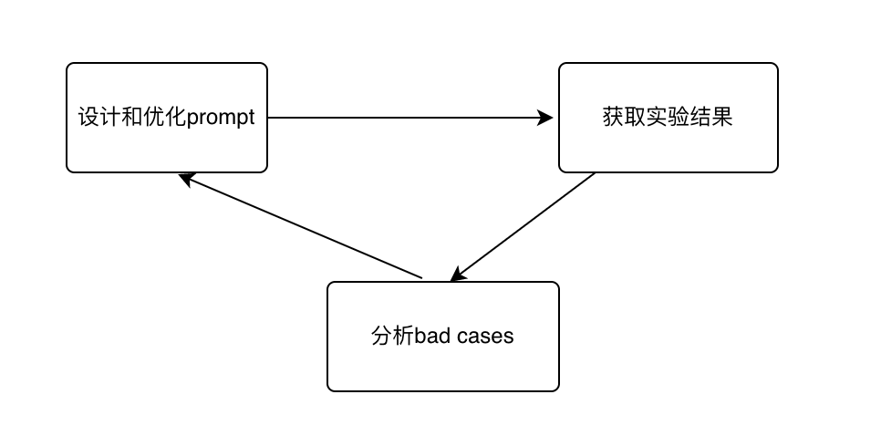

# AI 使用培训文档

## 一、引言
欢迎参加AI使用培训。本次培训旨在帮助大家掌握如何使用AI工具，提高工作效率。

培训内容包括基本使用方法、进阶技巧以及如何在工作中应用AI。

培训时长大概 1小时。


接下来介绍的 AI 均是指 类似 ChatGPT 的**聊天机器人**。

> ChatGPT 是由 OpenAI 开发的一种基于 GPT（生成式预训练变换模型）架构的聊天机器人。
> 它通过自然语言处理技术与用户进行对话，能够理解并生成类似人类语言的文本回答。
> ChatGPT 被训练在大量的互联网文本数据上，这使得它能够生成上下文相关且连贯的回复。
>
> 简单来说，ChatGPT 是一个**能理解和回应用户提问的人工智能聊天助手**。
> 它可以被用于多种用途，比如回答问题、提供建议、协助写作、编写代码、生成创意内容等。
> ChatGPT 不仅仅是简单的问答系统，它可以参与更复杂的对话，模仿人类的语言风格，甚至在某些情况下提供相对深度的分析。

## 二、访问AI工具
### 【2-1】 国内访问

手机注册，免费使用

| 平台     | 网址                                                         | 说明                                                         | 截图                                                         |
| -------- | ------------------------------------------------------------ | ------------------------------------------------------------ | ------------------------------------------------------------ |
| Kimi     | <br />https://kimi.moonshot.cn/ | 国内用户可以通过此链接访问Kimi平台。注册账号后，可以开始与AI进行对话。 |  |
| 豆包     | <br />https://www.doubao.com/chat/ | 抖音推出的AI聊天工具。通过抖音账号登录后，即可使用。         |  |
| 文心一言 | <br />https://yiyan.baidu.com/ | 百度推出的AI平台，提供多种AI功能。登录百度账号后，可以使用预设的AI应用。 |  |
| 通义千问 | <br />https://qianwen.aliyun.com/ | 阿里云提供的AI工具，支持丰富的AI应用。注册并登录后，可以使用其AI服务。 |  |

### 【2-2】 国外访问

需要魔法梯子，免费使用

| 平台       | 网址                                                         | 说明                                                        | 截图                                                         |
| ---------- | ------------------------------------------------------------ | ----------------------------------------------------------- | ------------------------------------------------------------ |
| ChatGPT    | <br />https://chatgpt.com/ | OpenAI提供的聊天工具。访问链接，注册账号后即可使用。        |  |
| MS Copilot | <br />https://www.bing.com/chat | New Bing，微软使用 OpenAI 提供的联网 AI，使用微软账号登陆。 |  |
| Gemini     | <br />https://gemini.google.com/ | Google提供的AI工具。通过Google账号登录后，即可使用。        |  |

## 三、基本使用示例


列举一些常见的预设问题，帮助用户快速入门使用AI工具。

### 【3-1】 **搜索引擎**：如何做一道家常菜？

> **用户：**
>
> 如何做红烧肉？

> **Kimi：**
>
> 

### 【3-2】 **生活助手**：今天的天气怎么样？

> **用户：**
>
> 今天上海的天气怎么样？

> **New Bing：**
>
> 

### 【3-3】 **图片生成器**：生成一张夏天的风景图。

> **用户：**
>
> 请生成一张夏天的海滩图。

> **doubao：**
>
> 

### 【3-4】 **翻译官**：将中文翻译成英文。

> **用户：**
>
> 请将下述的中文翻译成英文：
> 欢迎参加AI使用培训。
> 本次培训旨在帮助大家掌握如何使用AI工具，提高工作效率。
> 培训内容包括基本使用方法、进阶技巧以及如何在工作中应用AI。
> 培训时长大概 1小时。

> **ChatGPT：**
>
> 

## 四、进阶使用：Prompt Engineering

| 平台                  | 标题                                                         | 网址                                                         |
| --------------------- | ------------------------------------------------------------ | ------------------------------------------------------------ |
| OpenAI (ChatGPT)      | Prompt engineering -<br />Six strategies for getting better results | <br />https://platform.openai.com/docs/guides/prompt-engineering |
| Kimi                  | Prompt 最佳实践                                              | <br />https://platform.moonshot.cn/docs/guide/prompt-best-practice |
| 火山方舟大模型 (豆包) | Prompt 最佳实践                                              | <br />https://www.volcengine.com/docs/82379/1221660 |
| 文心一言              | 3分钟学会写文心一言指令                                      | <br />https://yiyan.baidu.com/learn |

### 【4-1】 以 OpenAI 的文档 “获得更好结果的 6 种策略” 说明

#### ① 编写清晰的说明
#### ② 提供参考文本
#### ③ 将复杂任务拆分为更简单的子任务
#### ④ 给模型时间 “思考”
#### ⑤ 使用外部工具
#### ⑥ 系统地测试更改

### 【4-2】 OpenAI 详细

#### 【4-2-1】 编写清晰的说明

这些模型无法读取您的心思。

如果输出太长，请要求简短的回复。

如果输出太简单，请要求专家级写作。

如果您不喜欢该格式，请演示您希望看到的格式。

模型对你想要什么的猜测越少，你得到它的可能性就越大。

##### 【4-2-1-1】策略：在查询中包含详细信息以获取更相关的答案

为了获得高度相关的响应，请确保请求提供任何重要的详细信息或上下文。否则，你就让模型来猜测你的意思。 

| **更糟**                     | **更好**                                                     |
| ---------------------------- | ------------------------------------------------------------ |
| 如何在 Excel 中添加数字？    | 如何在 Excel 中将一行美元金额相加？<br />我想对整张行自动执行此操作，所有总计都位于名为 “Total” 的列中的右侧。 |
| 谁是总统？                   | 谁是 2021 年的墨西哥总统，选举多久举行一次？                 |
| 编写代码来计算斐波那契数列。 | 编写一个 TypeScript 函数来有效地计算斐波那契数列。<br />对代码进行大量注释，以解释每个部分的作用以及为什么以这种方式编写。 |
| 总结会议记录。               | 将会议记录汇总在一个段落中。<br />然后写下演讲者及其每个关键点的 markdown 列表。<br />最后，列出演讲者建议的后续步骤或行动项目（如果有）。 |

##### 【4-2-1-2】策略：要求模型采用角色

系统消息可用于指定模型在其回复中使用的角色。

| 角色   | 提示词                                                       |
| ------ | ------------------------------------------------------------ |
| System | 当我请求帮助写东西时，<br />你会回复一个文档，<br />每段至少包含一个笑话或俏皮的评论。 |
| User   | 给我的钢螺栓供应商写一封感谢信，感谢他们按时、在短时间内交货。<br />这使我们能够交付一个重要的订单。 |

##### 【4-2-1-3】策略：使用分隔符清楚地指示输入的不同部分

三引号、XML 标签、章节标题等分隔符可以帮助划分要区别对待的文本部分。

| 角色   | 提示词                                                     |
| ------ | ---------------------------------------------------------- |
| System |                                                            |
| User   | 用俳句总结由三引号分隔的文本。<br />""" 在此处插入文本 """ |

| 角色   | 提示词                                                       |
| ------ | ------------------------------------------------------------ |
| System | 你将获得一对关于同一主题的文章（用 XML 标签分隔）。<br />首先总结每篇文章的论点。<br />然后指出其中哪一个提出了更好的论点并解释原因。 |
| User   | \<article\> 在此处插入第一篇文章 \</article\><br /><br />\<article\> 在此处插入第二篇文章 \</article\> |

| 角色   | 提示词                                                       |
| ------ | ------------------------------------------------------------ |
| System | 你将获得一份 论文摘要 和 建议的标题。<br />论文标题应该让读者对论文主题有一个很好的了解，但也应该引人注目。<br />如果标题不符合这些标准，请建议 5 个备选方案。 |
| User   | 摘要：在此处插入摘要<br />标题：在此处插入标题               |

对于诸如此类的简单任务，使用分隔符可能不会对输出质量产生影响。
但是，任务越复杂，消除任务详细信息的歧义就越重要。
不要让模型工作以准确理解您对他们的要求。

##### 【4-2-1-4】计划：指定完成任务所需的步骤

某些任务最好指定为一系列步骤。显式写出步骤可以使模型更容易遵循它们。

| 角色   | 提示词                                                       |
| ------ | ------------------------------------------------------------ |
| System | 使用以下分步说明来回复用户输入。<br />第 1 步 - 用户将为您提供三引号中的文本。将此文本总结为一句话，并带有前缀 “总结：”<br />第 2 步 - 将第 1 步中的摘要翻译成西班牙语，并带有前缀 “翻译：” |
| User   | """ 在此处插入文本 """                                       |

##### 【4-2-1-5】策略：提供示例

提供适用于所有示例的一般说明通常比逐个演示任务的所有排列更有效，但在某些情况下，提供示例可能更容易。
例如，如果您打算让模型复制难以明确描述的用户查询的特定样式。
这称为 “few-shot” 提示。

| 角色    | 提示词或回复                                                 |
| ------- | ------------------------------------------------------------ |
| System  | 以一致的风格回答。                                           |
| User    | 教我关于耐心的事                                             |
| AI 回复 | 那条刻画最深山谷的河流源自一股不起眼的泉水；<br />最宏伟的交响曲起始于一个音符；<br />最复杂的织锦始于一根孤单的纱线。 |
| User    | 教我关于海洋的知识。                                         |

##### 【4-2-1-6】策略：指定所需的输出长度

您可以要求模型生成具有给定目标长度的输出。
目标输出长度可以根据单词、句子、段落、项目符号等的数量来指定。
但请注意，指示模型生成特定数量的单词并不能以高精度工作。
该模型可以更可靠地生成具有特定段落或项目符号数量的输出。

| 角色   | 提示词                                                       |
| ------ | ------------------------------------------------------------ |
| System |                                                              |
| User   | 用大约 50 个单词总结由三引号分隔的文本。<br />""" 在此处插入文本 """ |

| 角色   | 提示词                                                       |
| ------ | ------------------------------------------------------------ |
| System |                                                              |
| User   | 将用三引号分隔的文本总结为 2 段。<br />""" 在此处插入文本 """ |

| 角色   | 提示词z                                                      |
| ------ | ------------------------------------------------------------ |
| System |                                                              |
| User   | 将用三引号分隔的文本总结为 3 个要点。<br />""" 在此处插入文本 """ |

#### 【4-2-2】策略：提供参考文本

##### 【4-2-2-1】策略：指示模型使用参考文本回答

如果我们可以为模型提供与当前查询相关的可信信息，那么我们可以指示模型使用提供的信息来撰写其答案。

| 角色   | 提示词                                                       |
| ------ | ------------------------------------------------------------ |
| System | 使用提供的文章（以三引号分隔）来回答问题。<br />如果在文章中找不到答案，请写下 “我找不到答案”。 |
| User   | <插入文章，每篇用三引号分隔。><br />问题：<这里插入问题>     |

鉴于所有模型的上下文窗口都有限，我们需要某种方法来动态查找与所提出的问题相关的信息。
[嵌入](https://platform.openai.com/docs/guides/embeddings/what-are-embeddings)可用于实现高效的知识检索。
有关如何实现此目的的更多详细信息，请参阅策略[“使用基于嵌入的搜索实现高效的知识检索”。](https://platform.openai.com/docs/guides/prompt-engineering/tactic-use-embeddings-based-search-to-implement-efficient-knowledge-retrieval)

> ......
>
> 剩余的内容未整理，请到网站上继续阅读：
>
> 
>
> https://platform.openai.com/docs/guides/prompt-engineering


### 【4-3】火山方舟大模型（抖音豆包） Prompt 最佳实践

#### 【4-3-1】Prompt engineering 简介

在自然语言处理（NLP）和对话系统中，提示（prompt）通常是指用户输入的文本或问题。
通过仔细设计和选择提示，可以指导模型的生成过程，使其更符合用户的需求。

Prompt engineering 是指设计和优化提示的过程，
以使人工智能模型能够更好地理解用户的意图和要求，并生成更准确、有用的响应。
Prompt Engineering 的主要目标是：

- 了解如何格式化和设计提示使模型效果最佳。
- 探索不同 prompt 对模型输出的影响。
- 创造出能优化模型输出的提示。

一般业务优化的过程，主要包括三个环节：

* prompt 设计
* prompt 优化
* prompt 评测

如下我们分别分三个部分来进行介绍。

#### 【4-3-2】Prompt 设计

**目标**：
选择适当的提示格式和语言，以清晰明确地表达用户的意图。

**过程**：
首先，需要明确目的，在使用 prompt 之前，明确目的是什么，即准备让模型做什么样的事情。
在明确目的之后，然后构造 prompt，构造的过程，
主要包括如下关键点：

##### 提供更多 query 相关的细节，可以获得更准确的答案

| **原始 query**                        | **更好的 query**                                             |
| ------------------------------------- | ------------------------------------------------------------ |
| 编写一篇太空探索的文章                | 为一群10-15岁的孩子编写一篇介绍太空探索历史的文章。          |
| 请写一篇文章，<br />关于环保的，500字 | 请撰写一篇500字的文章，讨论城市绿化对空气质量改善的影响。<br />文章应包括以下方面的内容：<br />城市绿化的定义，如树木和公园的增加，它们如何减少空气中的污染物，<br />以及在城市规划中推广城市绿化的可行性措施。<br />请提供相关数据和案例研究以支持你的论点。 |

##### 使用分隔符去更清晰地区分输入的不同部分

```bash
请把三个引号括起来的文本，分别总结成为一句话
''' 文本内容1 '''
''' 文本内容2 '''
```

##### **引导结构和组织要求**

在这个过程中，可以为任务提供明确的结构和组织要求。
指明任务的各个部分应该包括什么内容，有助于模型组织思维和材料。

```plain
请撰写一篇500字的文章，讨论城市绿化对空气质量改善的影响。文章应包括以下方面的内容：
  1. 引言：介绍城市绿化和其重要性。
  2. 影响空气质量的机制：解释树木和公园如何减少空气中的污染物。
  3. 可行性措施：讨论在城市规划中推广城市绿化的方法和挑战。
  4. 数据和案例研究：提供相关数据和至少两个城市绿化成功案例，以支持你的论点。
  5. 结论：总结城市绿化对空气质量的积极影响
```

##### 限制模型输出格式

最后，针对模型的输出，可以限制输出的格式，
一方面可以提高可读性，使结果更清晰明了；
另一方面也可以方便后续的处理，提高稳定性。

以提取“病症”的任务来展示下如何去限制模型的输出格式。
要求直接以 json 的格式返回。

```sql
请提取参考资料中的所有病症，并且以json格式返回。
回答满足下面的格式要求：
1、以json的格式返回答案，json只包括一个key, key="disease"，对应的值为列表，存储参考资料中的病症。
参考资料：
"""
失眠在《内经》中称为“目不瞑”、“不得眠”、“不得卧”，其原因主要有两种：一是其他病症影响，如咳嗽、呕吐、腹满等，使人不得安卧；二是气血阴阳失和，使人不能入寐。中医常用养心安神的方法治疗失眠,既可治标、又可治本,还可以避免西药安眠药容易成瘾的弊端。中医认为，失眠多因脏腑阴阳失调，气血失和所致。正如《灵枢大惑论》中记载：“卫气不得入于阴，常留于阳，留于阳则气满；阳气满则阳娇盛，不得入于阴则阴气虚，故目不瞑矣。”在临床上，治疗失眠应着重调理脏腑及气血阴阳，以“补其不足，泻其有余，调其虚实”，可采取补益心脾、滋阴降火、交通心肾、疏肝养血、益气镇惊、活血通络等治法，使气血和畅，阴阳平衡，脏腑功能恢复正常。
"""
```

#### 【4-3-3】Prompt 优化

##### 让模型扮演一个角色

让模型扮演一个具体的角色，模型的输出会更符合人类的表达方式，从而更容易被人类理解；同时输出也会更加一致。
例如，在问答系统中，让模型扮演一个特定领域的专家可以使其回答更符合该领域的知识和语言习惯，从而提高回答的一致性。

比如下面的案例，让模型分别扮演科学家和玄幻小说家生成一篇文章，文章的主题是：“黑洞是如何形成的”。

在科学家的角度下，模型基于科学事实首先解释了黑洞是什么，然后回答了黑洞的形成过程；

而在玄幻小说家的角度下，模型此时的输出不再基于科学事实，而是完全虚构，并且给人更多神秘的感觉，勾起读者的兴趣。





##### 提供样例

一般情况下，可以通过加入指令，来优化提示词，但是有时指令可能不容易描述清楚，提供示例会更容易。

比如：我们让模型充当一个文本二分类器，对用户的评价进行二分类，分类结果为：正面评价或者负面评价。




可以看出，正常情况下，模型暂时对于非绝对负面的评价都是分类为正面评价；而对于完全负面的评价才会分类为负面评价。

但是我们希望**模型对用户的评价是绝对正面时，才输出正面评价；否则都输出负面评价**。

比如，
“我最近在这家餐厅用餐，还行，但也不是特别惊艳” 这个 case，
我们希望模型输出 “负面评价”。

此时，可以提供一些示例供模型来参考学习。

```plain
请根据以下分类的方式，帮我分辨用户输入文本的类别是正面评价或是负面评价，请直接输出：正面评价/负面评价。

请参考如下样例：
示例1：
用户输入：我昨晚去了这家餐厅，他们的食物和服务都令人惊艳。我绝对会再次光顾。
输出：正面评价

示例2：
用户输入：这本书我看过，部分情节还行，但是整体情节拖沓，比较一般。
输出：负面评价

示例3：
用户输入：我昨天看了这部电影，我觉得还可以，但是有些部分也有点无聊。
输出：负面评价

示例4：
用户输入：我上周去看了这部电影，简直浪费时间。情节枯燥无味，演员的表现也差强人意。我真的后悔看了。
输出：负面评价

请回答如下问题：
用户输入：我最近在这家餐厅用餐，还行，但也不是特别惊艳。
输出：
```

除此之外，对于一些比较难的 case，只给 label，可能不好理解，
也可以尝试在给示例的同时，给出理由，这样模型会更容易理解。

```bash
请根据以下分类的方式，帮我分辨用户输入文本的类别是正面评价或是负面评价，请输出：正面评价/负面评价，并给出理由。

请参考如下样例：
示例1：
用户输入：我昨晚去了这家餐厅，他们的食物和服务都令人惊艳。我绝对会再次光顾。
输出：正面评价，理由：食物和服务都令人惊艳，而且顾客会再次光临

示例2：
用户输入：这本书我看过，部分情节还行，但是整体情节拖沓，比较一般。
输出：负面评价，理由：整体情节拖沓

示例3：
用户输入：我昨天看了这部电影，我觉得还可以，但是有些部分也有点无聊。
输出：负面评价，理由：这部电影有些部分也有点无聊

示例4：
用户输入：我上周去看了这部电影，简直浪费时间。情节枯燥无味，演员的表现也差强人意。我真的后悔看了。
输出：负面评价，理由：情节枯燥，演员表现也差强人意，用户后悔看了

请回答如下问题：
用户输入：我最近在这家餐厅用餐，还行，但也不是特别惊艳。
输出：
```

##### 指定完成任务需要的步骤

完成特定任务，如果有明确的步骤，通过指定完成任务需要的步骤，
可帮助模型按照正确的顺序执行，从而更好地生成回复。

```bash
请按照以下步骤写一个故事：
1 先设定故事背景和角色。
2 描述角色的目标和遇到的困难。
3 讲述角色如何克服困难并最终实现了目标。
4 最后以一个有趣的结局来结束故事。
```

这个 prompt 优化的示例中，明确指定了完成故事任务的步骤，
模型可以更有条理地构思和组织故事结构，从而提高故事的质量和连贯性。

##### 提供参考内容

针对特定领域的问题，如果涉及到专业知识，
提供相关的参考内容可以帮助模型更好地理解问题的背景和上下文，从而减少 *幻觉* 的出现。

```bash
请参考如下文档，回答用户问题：

###
文档名：文档内容
###

问题：[问题描述]
```

##### 给模型 “思考”时间

CoT（Chain of Thought，CoT）是一种思维工具，
通过逐步延伸和拓展一个主要想法，帮助人们进行更深层次的思考，并得出更复杂、更全面的结论。

在一些逻辑推理、数学运算等场景下，考虑使用 CoT 分解问题，
通过输出一些推断过程，可以增加模型输出正确结果的概率。

###### zero-shot

在 prompt 中加上 `Let's think step by step` 或者 `让我们一步一步分析思考`。

###### few-shots

以下是将用户输入的数字进行一系列加减乘除的例子。

```sql
你是一个计算器，请你将用户输入的数字分别加上2，减去3，乘以3，除以2后直接输出计算结果，以','作为分隔符进行返回。
示例如下：
"""
输入：1，2，3，4，5
答案：0, 1.5, 3, 4.5, 6
"""
输入：2，4，6，8，10
```

我们会发现，模型无法给出正确的答案，
所以，让模型处理这种复杂、多步骤的问题时，
我们可以遵循以下步骤：提供实例 > 分解问题 > 提供解释。

以下是将 CoT 融入到 prompt 的例子，分步骤地提供解释。

```sql
你是一个计算器，请你将用户输入的数字分别加上2，减去3，乘以3，除以2后直接输出计算结果，以','作为分隔符进行返回。
你可以参考以下的计算过程来帮助解决，
"""
对于输入：1，2，3，4，5
计算过程如下。
首先分别对输入1，2，3，4，5加上2，得到：3, 4, 5, 6, 7
然后将3，4，5，6，7分别减去3，得到：0, 1, 2, 3, 4
然后将0，1，2，3，4分别乘以3，得到：0, 3, 6, 9, 12
最后将0，3，6，9，12分别除以2，得到：0, 1.5, 3, 4.5, 6
答案是：0, 1.5, 3, 4.5, 6
"""
输入：2，4，6，8，10
```

#### 【4-3-4】Prompt 评测

##### 系统地测试变更

在完成上面的 prompt 设计和优化之后，prompt 会发生变更，但是如何判断这个变化，是否真的使系统变得更好。
一般是先通过看几个例子来确定哪个更好，

但是由于样本量小，很难区分是真正的改进还是运气导致，
所以需要设计一个好的评估集，在经过若干次迭代之后，用评估集来判定系统是否真正得到了改进。

好的评估集，一般具有如下特征：

- 多样性：评估集中应该包含足够的多样性，以涵盖不同的领域、话题和语境。
- 高质量：评估集中的数据应该是高质量的，能准确反映了真实的业务情况。
- 规模适中：评估集的规模应该足够大，以便能够充分评估 prompt 的性能，但又不能太大以至于导致计算资源的过度消耗。通常，几百到几千个样本是一个合理的范围。

##### 重复和迭代

prompt 的生成过程，实际上是一项实验性很强的过程，
在这个过程中，需要不断地尝试和调整不同的方法，以找到最优的 prompt。

一个典型的迭代路径是：
首先完成 prompt 设计，
接着基于设计好的 prompt 获取实验结果，分析 bad cases，解 bad cases，
并进一步优化 prompt，
通过多次的重复和迭代，
直到达到一个最优效果。

prompt 工程迭代过程如下：



最后，进一步需要说明的是，获取模型的最佳输出不仅需要优秀的 prompt，同时也取决于用户提供的反馈和修正。
prompt 优化完成之后，通过线上持续的反馈和修正，模型才能更顺利地理解并满足用户需求。


## 五、智能体的使用

https://www.doubao.com/chat/bot/create


## 六、提高工作效率

### 语言字典
利用AI解答C++问题，并生成代码示例。

1. **例子**：如何在C++中实现快速排序？
   - **示例对话**：用户：“请在C++中实现快速排序，并解释每一步骤。” AI：“以下是快速排序的实现代码...”
2. **解释**：AI会逐步解释代码的每一部分，帮助用户理解。

### 简易代码生成
利用AI生成正则表达式、代码注释等。

1. **正则表达式**：生成匹配电子邮件地址的正则表达式。
   - **示例对话**：用户：“请生成一个匹配电子邮件地址的正则表达式。” AI：“你可以使用以下正则表达式...”
2. **代码注释**：为一段代码生成注释。
   - **示例对话**：用户：“请为以下代码添加注释：`int a = 5; int b = 10; int sum = a + b;`” AI：“以下是带注释的代码...”

### 数控常识
AI可以帮助解答数控系统相关的常见问题。

1. **例子**：数控系统中常见的编程语言有哪些？
   - **示例对话**：用户：“数控系统中常用的编程语言有哪些？” AI：“常见的编程语言有C、C++、Python等。”

### 主轴示例

#### 主轴定义

> ##### User:
>
> 数控系统中 主轴 是什么？
>
> ##### ChatGPT:
>
> 在数控（数值控制）系统中，**主轴**（spindle）是指用于驱动机床执行主要切削运动的轴。它通常用于旋转刀具或工件，从而实现加工操作，如车削、铣削或钻孔。
>
> 具体来说，主轴的作用包括：
>
> 1. **驱动切削工具或工件旋转**：主轴通过电机驱动，使刀具或工件以一定的速度旋转，从而实现切削或加工操作。
>   
> 2. **控制加工速度**：主轴速度可以调节，以适应不同的加工需求和材料特性。高速加工适用于轻切削和精加工，而低速则适合重切削和粗加工。
>
> 3. **提供刚性和精度**：主轴通常设计得非常坚固，以确保加工过程中的高精度和稳定性。
>
> 主轴的性能直接影响加工质量和效率，因此在数控机床设计和使用中，主轴是一个非常关键的组件。

#### 刀路使用

> ##### User:
>
> 在数控系统中，如何通过数控编程控制主轴？
>
> ##### ChatGPT:
>
> 在数控系统中，控制主轴的运转通常是通过G代码（也称为数控编程代码）来实现的。以下是一些常见的数控G代码和M代码，它们用于控制主轴的启动、停止、转速和方向等：
>
> ###### 1. 主轴启动和停止
> - **M03**：启动主轴正转（顺时针方向）。通常与主轴速度（S代码）一起使用，例如：`M03 S1000`，表示以1000 RPM（转/分钟）的速度顺时针旋转。
> - **M04**：启动主轴反转（逆时针方向）。例如：`M04 S800`，表示以800 RPM的速度逆时针旋转。
> - **M05**：停止主轴转动。
>
> ###### 2. 主轴速度控制
> - **S代码**：设置主轴的转速。例如：`S1500`，表示主轴的转速设定为1500 RPM。
>
> ###### 3. 示例程序
> 以下是一个简单的数控程序示例，展示如何控制主轴的启动、设置转速和停止：
>
> ```gcode
> N10 G00 X0 Y0          ; 快速移动到起始位置
> N20 M03 S1200          ; 启动主轴正转，转速为1200 RPM
> N30 G01 X100 Y100 F200 ; 直线插补，进给速度为200 mm/min
> N40 M05                ; 停止主轴
> N50 M30                ; 程序结束并返回起点
> ```
>
> ###### 4. 进阶控制
> 在一些高级数控系统中，可以使用更复杂的命令和参数来精细控制主轴，比如通过**G96**和**G97**进行恒定表面速度控制（CSS）和固定转速控制。
>
> 了解数控系统的具体型号和控制器的特点对于使用这些代码非常重要，不同的系统可能会有不同的指令或参数要求。

#### 代码实现

> ##### User:
>
> 在数控系统软件中，通过C++实现一个简易的主轴
>
> ##### ChatGPT:
>
> 在数控系统（CNC）软件中，通过C++实现一个简易的主轴控制系统需要考虑到以下几个方面：主轴的启动、停止、转速控制，以及转向控制等。以下是一个简化的实现示例：
>
> ```cpp
> #include <iostream>
> #include <thread>
> #include <chrono>
> 
> class Spindle {
> private:
>     bool isRunning;
>     int speed;  // 转速 (RPM)
>     bool direction;  // 方向: true 表示顺时针，false 表示逆时针
> 
> public:
>     Spindle() : isRunning(false), speed(0), direction(true) {}
> 
>     // 启动主轴
>     void start() {
>         if (!isRunning) {
>             isRunning = true;
>             std::cout << "Spindle started." << std::endl;
>             // 可以在这里添加更多逻辑来启动硬件，如与PLC通信
>         } else {
>             std::cout << "Spindle is already running." << std::endl;
>         }
>     }
> 
>     // 停止主轴
>     void stop() {
>         if (isRunning) {
>             isRunning = false;
>             speed = 0;
>             std::cout << "Spindle stopped." << std::endl;
>         } else {
>             std::cout << "Spindle is already stopped." << std::endl;
>         }
>     }
> 
>     // 设置转速
>     void setSpeed(int newSpeed) {
>         if (isRunning) {
>             speed = newSpeed;
>             std::cout << "Spindle speed set to " << speed << " RPM." << std::endl;
>             // 可以在这里添加更多逻辑来调整硬件转速
>         } else {
>             std::cout << "Cannot set speed: Spindle is not running." << std::endl;
>         }
>     }
> 
>     // 设置方向
>     void setDirection(bool newDirection) {
>         if (isRunning) {
>             direction = newDirection;
>             std::cout << "Spindle direction set to " << (direction ? "Clockwise" : "Counter-Clockwise") << "." << std::endl;
>             // 可以在这里添加更多逻辑来调整硬件方向
>         } else {
>             std::cout << "Cannot set direction: Spindle is not running." << std::endl;
>         }
>     }
> 
>     // 模拟运行状态
>     void run() {
>         while (isRunning) {
>             std::cout << "Spindle running at " << speed << " RPM in " << (direction ? "Clockwise" : "Counter-Clockwise") << " direction." << std::endl;
>             std::this_thread::sleep_for(std::chrono::seconds(1));  // 模拟时间间隔
>         }
>     }
> };
> 
> int main() {
>     Spindle spindle;
> 
>     spindle.start();
>     spindle.setSpeed(1500);
>     spindle.setDirection(true);
> 
>     std::thread spindleThread(&Spindle::run, &spindle);
> 
>     std::this_thread::sleep_for(std::chrono::seconds(5));
> 
>     spindle.setSpeed(2000);
>     spindle.setDirection(false);
> 
>     std::this_thread::sleep_for(std::chrono::seconds(5));
> 
>     spindle.stop();
> 
>     spindleThread.join();
> 
>     return 0;
> }
> ```
>
> ###### 代码说明：
> 1. **Spindle 类**：
>    - `isRunning`: 表示主轴是否正在运行。
>    - `speed`: 主轴的当前转速。
>    - `direction`: 主轴的旋转方向。
>    - `start()` 方法：启动主轴。
>    - `stop()` 方法：停止主轴。
>    - `setSpeed()` 方法：设置主轴的转速。
>    - `setDirection()` 方法：设置主轴的旋转方向。
>    - `run()` 方法：模拟主轴的运行状态，定期输出当前转速和方向。
>
> 2. **main() 函数**：
>    - 创建 `Spindle` 对象，并通过各种方法控制主轴的启动、停止、转速设置和方向设置。
>    - 通过一个线程模拟主轴的持续运行。
>
> ###### 进一步扩展：
> - 增加与硬件的实际通信代码，比如通过串口、GPIO、或其他方式控制实际的CNC硬件。
> - 添加更多的控制逻辑，比如加速、减速曲线，以及紧急停止功能。
> - 集成到更大的CNC系统中，与其他部件（如进给轴控制系统）协同工作。

## 七、AI的基础实现
### 机器学习的Hello World
通过一个简单的TensorFlow工程，展示机器学习的基本流程。

1. **下载并安装TensorFlow**
   - **步骤**：
     1. 打开终端或命令提示符。
     2. 输入命令：`pip install tensorflow`
     3. 等待安装完成。

2. **准备数据集**
   - **步骤**：
     1. 选择一个简单的数据集，例如MNIST手写数字数据集。
     2. 下载数据集并加载到程序中。

3. **训练模型**
   - **步骤**：
     1. 定义一个简单的神经网络模型。
     2. 使用数据集训练模型。
     3. 监控训练过程中的损失值和准确率。

4. **测试和预测**
   - **步骤**：
     1. 使用测试数据集评估模型性能。
     2. 输入新的数据进行预测，查看预测结果。

5. **演示**
   - **内容**：
     1. 现场演示如何使用TensorFlow进行数据训练和预测。
     2. 解释每一步的意义，帮助理解机器学习的基本原理。

### AI实现概述
简要说明AI的实现，包括机器学习和深度学习的基本概念。

1. **机器学习**：通过数据训练模型，使用模型进行预测和分类。
2. **深度学习**：使用多层神经网络处理复杂的数据，进行图像识别、自然语言处理等任务。

### 参考

* 深度学习

  * 【深度学习之神经网络的结构 Part 1】

    https://b23.tv/NhyWasR

    

    

  * 【GPT是什么？直观解释Transformer | 深度学习第5章】

    https://b23.tv/zZgLChS

    
    

* 本地部署 AI 绘图

  * 【合集·B站第一套Stable Diffusion系统课程，来了！】

    https://b23.tv/4YN2UYv

    

* 本地部署 GLM

  * 【GLM-4-9B 开源，探索模型极限】

    https://b23.tv/diQEZZu

    


## 八、结束语

感谢大家的参与，希望本次培训能帮助你们更好地使用AI工具，提高工作效率。

如果有任何问题，欢迎随时提问。


> 文档也放到了 Gitee 和 Github 上
>
> * Gitee
>
>   https://gitee.com/weihongzyx/AI_Usage_Training
>
>   
>
> * Github
>
>   https://github.com/WHzhongyixin/AI_Usage_Training
>
>   